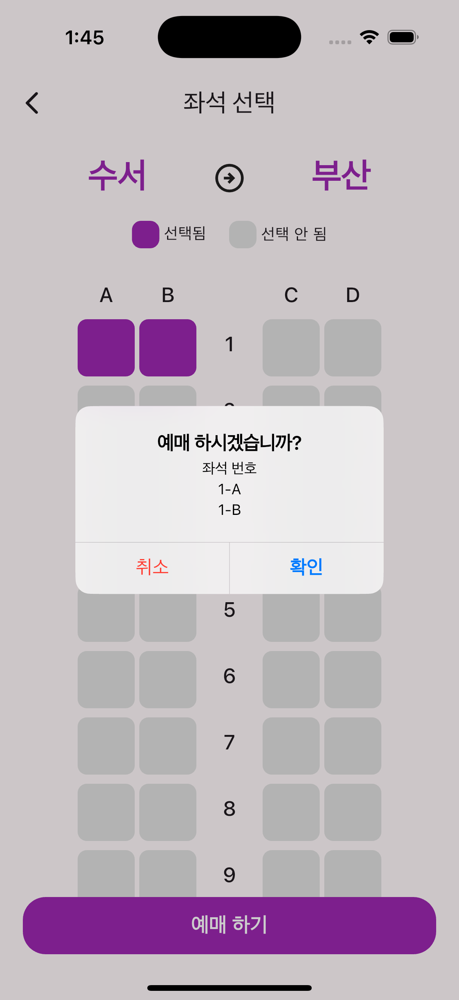
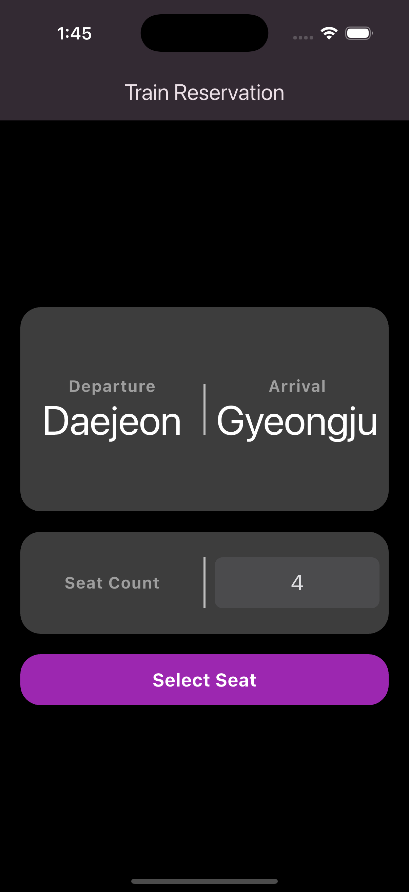
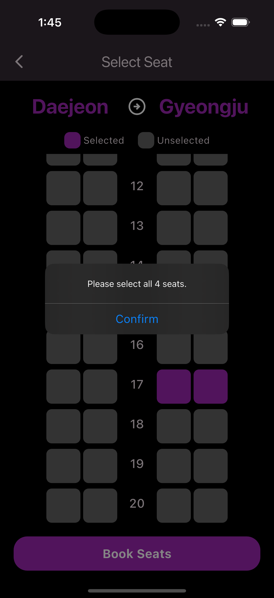

# 🚆 Flutter Train App

_기차 여행을 떠날 준비 되셨나요?_

**Flutter Train App**은 Flutter로 개발된 깔끔하고 직관적인 좌석 예약 앱입니다.
출발역과 도착역을 선택하고, 지정한 수만큼 좌석을 터치하여 손쉽게 예약할 수 있습니다.
단순한 구조 속에서도 사용자 편의성과 기능 확장성을 고려하여 설계되었습니다.

---

## 🧩 기능 소개

1. 출발/도착역 설정 🚉
   - 역 리스트 선택 기능
     - 출발역과 도착역을 리스트에서 선택 가능하며, 동일 역 선택은 방지됩니다.
   - 한글 표시 지원
     - 내부 enum 값은 한글로 변환되어 사용자 친화적으로 보여집니다.
2. 좌석 예약 기능 🎫
   - 좌석 선택 UI 구성
     - 사용자는 좌석 레이아웃에서 원하는 좌석을 탭하여 선택하거나 해제할 수 있습니다.
   - 예약 좌석 수 제한
     - 사용자가 선택한 좌석 수만큼만 선택 가능하며, 초과 선택은 불가능합니다.
   - 선택 좌석 표시
     - 선택된 좌석은 색상으로 표시되며, 상단에 3-A, 2-B 형태로 요약됩니다.
3. 다이얼로그 및 안내 📢
   - 경고 다이얼로그
     - 출발역과 도착역이 설정되지 않은 경우, 경고창을 통해 사용자에게 안내합니다.
   - 확인 버튼 구성
     - 확인 다이얼로그는 기본 파란색 확인 버튼이 포함된 CupertinoDialog 스타일로 구성되어 있습니다.

---

## 🗂️ 프로젝트 구조

```
lib/
├── main.dart                         # 앱 실행 시작점
├── core/
│   ├── constants/
│   │   └── station.dart              # 역 정보 enum 정의
│   │
│   ├── helpers/
│   │   └── ui_helpers.dart           # 여백, 크기 계산 등 UI 관련 유틸 함수
│   │
│   ├── theme/
│   │   ├── button_themes.dart        # 버튼 테마 정의 (FilledButton 등)
│   │   ├── color_schemes.dart        # 라이트/다크 테마 색상 정의
│   │   ├── cupertino_themes.dart     # CupertinoDialog 등 iOS 스타일 테마
│   │   ├── custom_colors.dart        # 커스텀 컬러 상수 정의
│   │   ├── text_themes.dart          # 텍스트 테마 정의
│   │   └── theme.dart                # 전체 테마 통합 설정
│   │
│   └── widgets/
│       ├── main_button.dart          # 공통 버튼 위젯
│       └── dialogs/
│           ├── confirm_dialog.dart   # 확인용 다이얼로그 구성
│           └── info_dialog.dart      # 정보 안내 다이얼로그 구성
│
├── features/
│   ├── home/
│   │   ├── home_page.dart            # 앱 메인 페이지 (좌석 예약 메인)
│   │   └── widgets/
│   │       ├── box_container.dart    # 콘텐츠 감싸기용 레이아웃 박스
│   │       ├── seat_count_box.dart   # 좌석 개수 선택 박스
│   │       ├── station_result.dart   # 출발/도착역 결과 출력 UI
│   │       └── stations_box.dart     # 출발/도착역 선택 박스
│   │
│   ├── seat/
│   │   ├── seat_page.dart            # 좌석 선택 페이지
│   │   ├── models/
│   │   │   └── seat_position.dart    # 좌석 위치 모델 정의 (row, col)
│   │   └── widgets/
│   │       ├── action_seat_box.dart  # 탭 가능한 좌석 박스
│   │       ├── seat_box.dart         # 기본 좌석 박스
│   │       ├── seat_col_list.dart    # 좌석 세로 목록
│   │       ├── seat_header.dart      # 경로 정보 헤더
│   │       ├── seat_list_view.dart   # 좌석 전체 목록
│   │       └── seat_select_info.dart # 선택/미선택 좌석 정보 표시
│   │
│   └── stationList/
│       ├── station_list_page.dart    # 출발/도착역 선택 페이지
│       └── widgets/
│           ├── selectable_station_tile.dart  # 선택 가능한 역 타일
│           └── station_tile.dart              # 역 정보 타일
```

---

## 🧰 기술 스택

- **개발 언어:** [Dart](https://dart.dev/)
- **프레임워크:** [Flutter](https://flutter.dev/) 3.32+
- **상태 관리:** 간단한 StatefulWidget 중심
- **UI:** Material & Cupertino 혼합 UI
- **아키텍처:** 기능 중심 (feature-first) 구조
- **테마 구성:** color_schemes, text_themes, button_themes 등으로 분리된 라이트/다크 테마 지원

---

## ▶️ 실행 방법

1. [Flutter SDK](https://docs.flutter.dev/get-started/install) 설치
2. 패키지 설치: `flutter pub get`
3. 시뮬레이터 또는 실제 디바이스 실행: `flutter run`

---

## 📲 사용자 흐름

1. 출발역 선택 → 도착역 선택
   - 동일한 역은 선택 불가 (회색 비활성화)
2. 예약 좌석 수 선택
   - CupertinoPicker로 1~10좌석 중 선택
3. 좌석 선택 화면 이동
   - 선택한 수만큼만 좌석 선택 가능
   - 이미 선택된 좌석은 색상으로 표시됨
4. 좌석 선택 완료 → 예약 완료 처리
   - 선택된 좌석 목록 확인
   - 예약 완료 시 홈 화면으로 이동

---

## 📸 스크린샷 미리보기

### 🌞 Light Mode

|  |  |  |
| :------------------------------------: | :------------------------------------: | :------------------------------------: |
|  |  |  |

### 🌙 Dark Mode

|  |  |  |
| :----------------------------------: | :----------------------------------: | :----------------------------------: |
|  |  |  |
