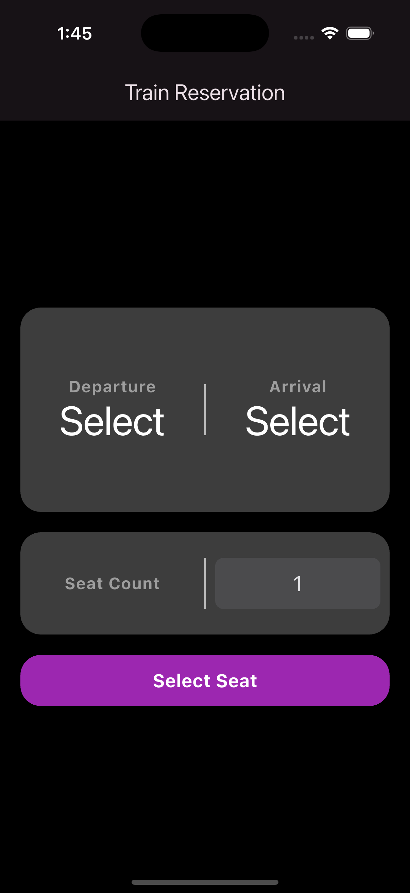
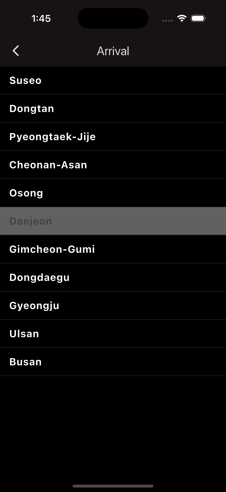

# 🚆 Flutter Train App

_기차 여행을 떠날 준비 되셨나요?_

**Flutter Train App**은 Flutter로 개발된 깔끔하고 직관적인 좌석 예약 앱입니다.
출발역과 도착역을 선택하고, 지정한 수만큼 좌석을 터치하여 손쉽게 예약할 수 있습니다.
단순한 구조 속에서도 사용자 편의성과 기능 확장성을 고려하여 설계되었습니다.

---

## 🧩 기능 소개

1. 출발/도착역 설정 🚉
   - 역 리스트 선택 기능
     - 출발역과 도착역을 리스트에서 선택 가능하며, 동일 역 선택은 방지됩니다.
   - 한글 표시 지원
     - 내부 enum 값은 한글로 변환되어 사용자 친화적으로 보여집니다.
2. 좌석 예약 기능 🎫
   - 좌석 선택 UI 구성
     - 사용자는 좌석 레이아웃에서 원하는 좌석을 탭하여 선택하거나 해제할 수 있습니다.
   - 예약 좌석 수 제한
     - 사용자가 선택한 좌석 수만큼만 선택 가능하며, 초과 선택은 불가능합니다.
   - 선택 좌석 표시
     - 선택된 좌석은 색상으로 표시되며, 상단에 3-A, 2-B 형태로 요약됩니다.
3. 다이얼로그 및 안내 📢
   - 경고 다이얼로그
     - 출발역과 도착역이 설정되지 않은 경우, 경고창을 통해 사용자에게 안내합니다.
   - 확인 버튼 구성
     - 확인 다이얼로그는 기본 파란색 확인 버튼이 포함된 CupertinoDialog 스타일로 구성되어 있습니다.
4. 다국어 지원 🌐
   - 한국어/영어 지원
     - 앱 내 텍스트는 사용자의 디바이스 언어 설정에 따라 자동으로 변경됩니다.
   - ARB 파일 기반
     - intl_en.arb / intl_ko.arb 파일을 통해 메시지가 정의되고 관리됩니다.
   - 커스텀 역 이름/좌석 안내 메시지 대응
     - 선택 좌석 수, 경고 메시지 등도 다국어로 처리되어 글로벌 사용자 접근성을 높입니다.

---

## 🗂️ 프로젝트 구조

```
flutter_train_app/
├── lib/
│   ├── main.dart
│   ├── core/                       # 공통 유틸 및 테마
│   │   ├── constants/              # 역 정보 enum 등
│   │   ├── helpers/                # 헬퍼 함수
│   │   ├── theme/                  # 라이트/다크 테마 구성
│   │   └── widgets/                # 공통 위젯 (버튼, 다이얼로그 등)
│   │
│   ├── features/                   # 기능별 화면 구조
│   │   ├── home/                   # 홈 화면
│   │   │   ├── home_page.dart
│   │   │   └── widgets/            # 홈 UI 위젯
│   │   │
│   │   ├── stationList/           # 역 선택 화면
│   │   │   ├── station_list_page.dart
│   │   │   └── widgets/            # 역 선택 UI 위젯
│   │   │
│   │   └── seat/                  # 좌석 선택 화면
│   │       ├── seat_page.dart
│   │       ├── models/             # 좌석 관련 데이터 모델
│   │       └── widgets/            # 좌석 선택 UI 위젯
│   ├── l10n/                           # 다국어 설정
│   │   ├── intl_ko.arb                 # 한국어 메시지
│   │   └── intl_en.arb                 # 영어 메시지
│   │
│   └── generated/                      # Flutter gen-l10n 생성 파일
│       └── intl/                       # 메시지 번역 Dart 파일
│
├── pubspec.yaml                   # 프로젝트 의존성 및 설정
└── l10n.yaml                      # 다국어 관련 설정 파일
```

---

## 🧰 기술 스택

- **개발 언어:** [Dart](https://dart.dev/)
- **프레임워크:** [Flutter](https://flutter.dev/) 3.32+
- **상태 관리:** 간단한 StatefulWidget 중심
- **UI:** Material & Cupertino 혼합 UI
- **아키텍처:** 기능 중심 (feature-first) 구조
- **테마 구성:** color_schemes, text_themes, button_themes 등으로 분리된 라이트/다크 테마 지원
- **다국어 지원:** Flutter Intl을 활용한 한국어/영어 다국어 설정

---

## ▶️ 실행 방법

1. [Flutter SDK](https://docs.flutter.dev/get-started/install) 설치
2. 패키지 설치: `flutter pub get`
3. 시뮬레이터 또는 실제 디바이스 실행: `flutter run`

---

## 📲 사용자 흐름

1. 출발역 선택 → 도착역 선택
   - 동일한 역은 선택 불가 (회색 비활성화)
2. 예약 좌석 수 선택
   - CupertinoPicker로 1~10좌석 중 선택
3. 좌석 선택 화면 이동
   - 선택한 수만큼만 좌석 선택 가능
   - 이미 선택된 좌석은 색상으로 표시됨
4. 좌석 선택 완료 → 예약 완료 처리
   - 선택된 좌석 목록 확인
   - 예약 완료 시 홈 화면으로 이동

---

## 📸 스크린샷 미리보기

### 🌞 Light Mode

|  |  |  |
| :------------------------------------: | :------------------------------------: | :------------------------------------: |
|  |  |  |

### 🌙 Dark Mode

|  |  |  |
| :----------------------------------: | :----------------------------------: | :----------------------------------: |
|  |  |  |
